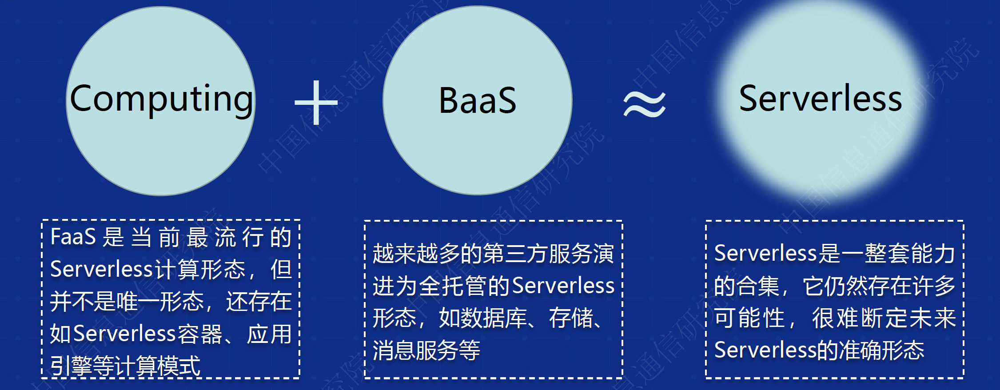
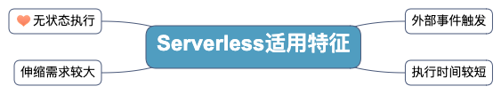
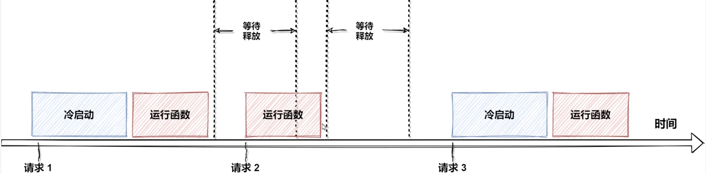

## 1.1 what

Serverless定义

> Serverless（无服务器架构）是指服务端逻辑由开发者实现，运行在无状态的计算容器中，由事件触发，完全被第三方管理，其业务层面的状态则存储在数据库或其他介质中。
>
> Serverless 是云原生技术发展的高级阶段，可以使开发者更聚焦在业务逻辑，而减少对基础设施的关注。

狭义上：Serverless = FaaS + BaaS

**BaaS**

BaaS（Backend as a Service）后端即服务，一般是一个个的API调用后端或别人已经实现好的程序逻辑，比如身份验证服务Auth0，这些BaaS通常会用来管理数据，还有很多公有云上提供的我们常用的开源软件的商用服务，比如亚马逊的RDS可以替代我们自己部署的MySQL，还有各种其它数据库和存储服务。

**FaaS**

FaaS（Functions as a Service）函数即服务，FaaS是无服务器计算的一种形式，当前使用最广泛的是AWS的Lambada。FaaS本质上是一种事件驱动的由消息触发的服务，FaaS供应商一般会集成各种同步和异步的事件源，通过订阅这些事件源，可以突发或者定期的触发函数运行。

广义上：Serverless = 服务端免运维 = 具备 Serverless 特性的云服务

## 1.2 why

云计算的基础设施外包带来五大好处：

- 降低人工成本
- 降低风险
- 降低基础设施成本
- 扩展性
- 交付时间

Serverless 同样也有这五大优点， 前四个都或多或少是关于成本节约的。但是，Serverless最大的好处是，它减少了从新的想法到实施上线的时间，换句话说，它能够让你更快地创新。

### 降低人力成本

不需要再自己维护服务器，操心服务器的各种性能指标和资源利用率，而是关心应用程序本身的状态和逻辑。而且serverless应用本身的部署也十分容易，不需使用Puppet、Chef、Ansible或Docker来进行配置管理，降低了运维成本。同时，对于运维来说，也不再需要监控那些更底层的如磁盘使用量、CPU使用率等底层和长期的指标信息，而是监控应用程序本身的度量，这将更加直观和有效。

### 降低风险

对于组件越多越复杂的系统，出故障的风险就越大。使用BaaS或FaaS将它们外包出去，让专业人员来处理这些故障，比自己来修复更可靠，利用专业人员的知识来降低停机的风险，缩短故障修复的时间，让系统稳定性更高。

### 减少资源开销

在申请主机资源一般会评估一个峰值最大开销来申请资源，往往导致过度的配置，这意味着即使在主机闲置的状态下也要始终支付峰值容量的开销。对于某些应用来说这是不得已的做法，比如数据库这种很难扩展的应用，而对于普通应用这就显得不太合理了，虽然都觉得即使浪费了资源也比当峰值到来时应用程序因为资源不足而挂掉好。

解决这个问题最好的办法就是，不计划到底需要使用多少资源，而是根据实际需要来请求资源，当然前提必须是整个资源池是充足的（公有云显然更适合）。根据使用时间来付费，根据每次申请的计算资源来付费，让计费的粒度更小，将更有利于降低资源的开销。这是对应用程序本身的优化，例如让每次请求耗时更短，让每次消耗的资源更少将能够显著节省成本。

### 增加缩放的灵活性

以AWS Lamba为例，当平台接收到第一个触发函数的事件时，它将启动一个容器来运行你的代码。如果此时收到了新的事件，而第一个容器仍在处理上一个事件，平台将启动第二个代码实例来处理第二个事件。AWS lambad的这种自动的零管理水平缩放，将持续到有足够的代码实例来处理所有的工作负载。

但是，AWS仍然只会向您收取代码的执行时间，无论它需要启动多少个容器实例要满足你的负载请求。例如，假设所有事件的总执行时间是相同的，在一个容器中按顺序调用Lambda 100次与在100个不同容器中同时调用100次Lambda的成本是 一样的。当然AWS Lambada也不会无限制的扩展实例个数，如果有人对你发起了DDos攻击怎么办，那么不就会产生高昂的成本吗？AWS是有默认限制的，默认执行Lambada函数最大并发数是1000。

### 缩短创新周期

小团队的开发人员正可以在几天之内从头开始开发应用程序并部署到生产。使用短而简单的函数和事件来粘合强大的驱动数据存储和服务的API。完成的应用程序具有高度可用性和可扩展性，利用率高，成本低，部署速度快。

## 1.3 how

### 适用特征

Serverless框架的适用特征有以下几方面：

### 应用场景

1. 应用程序后端 - 小程序
2. 计划任务 - 定时备份
3. 数据处理操作 - 图文转换、AI学习
4. 强弹性计算 - 电商促销、社交直播

### 应用示例

#### 1、社交/电商类应用中压缩图片

场景介绍

用户通过客户端或移动设备上传图片，图片进行不同分辨率的压缩已适应不同设备，亦或需要增加水印，生成缩略图等。通过事件触发处理函数执行，无需为函数保留资源。

主要处理步骤为：

- 将图片上传到指定的对象存储桶中
- 将用户上传的每个图像的尺寸进行压缩或者图片打水印
- 将处理完后的图像上传到另一个指定的对象存储桶中

#### 2、简易中文信息过滤

场景介绍：

用分布式消息服务来存储一些重要信息。需要对消息进行处理，判断消息是否适合发布（有些消息不适合发布，例如政治敏感、广告等）。业务爆发时可以自动调度资源运行更多函数实例以满足处理需求。

主要处理步骤为：

- 使用DMS服务，在其中创建消息队列，同时在队列中创建消费组，并生产消息。
- 在函数服务中，创建函数，为函数创建DMS触发器，通过轮询的方式，获取DMS队列中的信息。
- 在函数中，通过对读取信息进行处理，判断信息是否敏感，是否符合发布

#### 3、由事件触发的批量数据处理

场景介绍：

间隔执行或定时触发的ETL任务。或机器学习训练数据集预处理，例如游戏AI训练。只有对函数处理文件数据的时间进行计费，无需购买冗余的资源用于非峰值处理

主要处理步骤为：

- 数据汇集到指定的对象存储桶中
- 将处理过程的mapreduce按照角色拆分成多个函数
- 处理完后的结果存储至缓存数据库供聚合
- 使用函数服务聚合结果后传到另一个指定的对象存储桶中

图片：serverless实践一文

## 1.4 weakness

### 状态管理

要想实现自由的缩放，无状态是必须的，而对于有状态的服务，使用serverless这就丧失了灵活性，有状态服务需要与存储交互就不可避免的增加了延迟和复杂性。

### 延迟

应用程序中不同组件的访问延迟是一个大问题，我们可以通过使用专有的网络协议、RPC调用、数据格式来优化，或者是将实例放在同一个机架内或同一个主机实例上来优化以减少延迟。

而serverless应用程序是高度分布式、低耦合的，这就意味着延迟将始终是一个问题，单纯使用serverless的应用程序是不太现实的。

### 本地测试

Serverless应用的本地测试困难是一个很棘手的问题。虽然可以在测试环境下使用各种数据库和消息队列来模拟生产环境，但是对于无服务应用的集成或者端到端测试尤其困难，很难在本地模拟应用程序的各种连接，并与性能和缩放的特性结合起来测试，并且serverless应用本身也是分布式的，简单的将无数的FaaS和BaaS组件粘合起来也是有挑战性的。

# 二、常见平台框架

平台和框架的多样性导致Serverless没有形成标准化，平台商一般根据自己理解来实现，就会造成了迁移成本很大，存在厂商锁定等问题。

2018.7月，谷歌站了出来，携手IBM、RedHat 等各大佬发布起了开源**Kantive项目**，**目标将Severless 标准化，与云平台无关，他提供搭建Severless的能力**，而不是提供Severless平台。

推荐本书：[Knative 入门.pdf](https://gw.alipayobjects.com/os/basement_prod/6fb694c1-9637-4caf-a64b-01271e919a98.pdf)

在Knative构建Severless 生态由哪些组成? 分别是

- 底层的kubernetes，即k8s ( 中间8个字母)， 是**容器编排的标准**，即管理docker容器部署的
- 在上层即Knative, 将定义**源码到构建到部署到管理的标准**，下层通过k8s进行容器部署管理
- 在上层是Istio, 它定位为**服务网格标准**，它的目标将服务治理之间的网络通信变成底层的基础设施，与语言无关

Knative内部生态有三大组件组成，分别是：

- [Build](https://github.com/knative/build) **负责提供标准模板，从源码仓库到镜像构建到镜像仓库（PS：在v0.8.0后由Tekton Pipelines项目替代）**
- [Eventing](https://github.com/knative/eventing) **服务事件驱动，将服务绑定到事件，对发布/订阅进行抽象**
- [Serving](https://github.com/knative/serving) **动态调整工作负载流量版本切分，还有log/metrics/tracing/monitor模块**

## FaaS 运行机制

代码下载-->启动容器-->初始化环境（前三个阶段冷启动）-->运行代码（热启动）

热启动执行上下文重用（实例复用），需要保证云函数无状态性，即当前运行的函数不能依赖上个函数运行时的残留信息。

