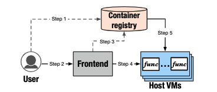

### 1、介绍

无服务器计算允许开发人员将传统的基于服务器的单体应用程序分解为更细粒度的云功能，从而实现了一种构建和扩展应用程序和服务的新方法。程序员编写业务逻辑，云服务提供商提供配置、扩展、管理运行功能。

目前流行的打包部署云函数是使用自定义镜像，它极大的增强了可用性、可移植性和工具支持。（1）机器学习、数据分析、视频处理，限制他们的包大小是不现实的（aws lambda 限制上传的包大小为250m）（2）docker容器（3）DevOps功能，增量更新等。

FaaS平台最具吸引力的是资源弹性，允许用户程序在几秒内按需扩展到几万个云功能，者对基于自定义容器的FaaS基础设施提供快速容器配置的挑战很大。当前的FaaS提供商在应对突发流量时，扩展容器要复制当前容器几百上千个，工作负载导致网络贷款瓶颈，高弹性时噱头。其次，docker容器大，从后备存储提取会有明显的冷启动延迟，处于高争用状态。

现在的解决方案不行，Kraken，DADI使用点对点 (P2P) 方法来加速大规模容器配置，然而，它们需要一个或多个专用的、强大的服务器作为根节点来进行数据播种、元数据管理和协调。

阿里的方案行，FAASNET是一种用于加速无服务器容器配置的轻量级自适应中间件系统。FAASNET 通过将容器配置过程分散到以基于功能的树状结构组织的主机 VMs 之间来实现高可扩展性。功能树（FT）是一个逻辑的、基于树的网络覆盖。 FT 由多个主机 VM 组成，并允许以可扩展的方式跨所有 VM 分配容器运行时的代码包。FAASNET 通过动态适应 FT 拓扑的树平衡算法实现高适应性，以适应 VM 的加入和离开。

一个典型的FaaS VM池有数千个小型VM实例。FaaSNet很快，在8.3秒内完成2500个功能容器的配置（仅比配置单个容器的时间长1.6倍），比目前P2P注册中心快十几倍。

### 2、背景及意义

2.1 工作流

2.2 工作负载分析

2.2.1 工作负载激增   优势：按需收费。分析吞吐量峰值。

2.2.2 冷启动  需要获取镜像数据，延迟很长，分析了北京上海的容器下载成本日志

### 3、FaaSNet 设计

3.1 设计

FAASNET 分散和并行化了跨 VM 的容器配置。FAASNET 引入了一种称为功能树 (FT) 的抽象，以实现高效的大规模容器配置。FAASNET将一个FT管理器组件和一个工作器组件集成到我们现有的FaaS调度程序和 VM 代理中，以进行协调的FT管理。

调度器通过FT的插入和删除API来管理功能树。FT是一个二叉树，连接多个主机VM形成一个容器配置网络。每个VM运行一个FaasVM代理，负责VM本地功能管理。将一个FaaSNet工作线程集成到VM代理中执行容器配置任务。

在函数调用路径中，有空闲的VM就分配，没有的话调度程序查询其本地FT元数据并发送RPC对FT的faasnet的请求，以启动容器配置过程 。

函数部署路径上，从容器注册表中提取常规图像，逐块压缩图像层，创建包含格式相关信息的元数据文件。

3.2 函数树

1）一个函数有一个单独的FT，2）FTs解耦数据平面和控制平面，3）FaaSNet采用平衡二叉树，动态适应工作负载。

以函数粒度管理树。平衡二叉树，每个树节点都有一个传入边和两个传出边，可以有效地限制每个VM的并发下载操作次数。高度log2N，高度会影响数据传播效率，FT管理器调用插入和删除API动态增长或缩小FT。

3.3 函数树集成

将FT方案集成到阿里云FaaS平台，FaaSNet worker负责：1）服务调度程序的命令执行镜像下载和容器供应。2）管理虚拟机功能容器。

FT元数据管理：内存映射表<functionId, FT>，FT数据结构管理功能和VM的信息。

函数运行在VMs上：FaaSNet允许一个虚拟机保存同一个用户多个函数。函数计算使用装箱启发式算法，该试验限制了vm上放置的function数量为20。

容器配置协议：在调用请求中，如果调度器检测到没有足够的VM服务请求，或者是当前所有的VMs都很忙，会在空闲的VM池里启动一个或者多个VMs进入容器配置流程。假定VM1是新建的，需要下载配置信息及镜像，VM2是给VM1提供的容器。

FT容错：如果VM关闭了，调度器会通知FT管理器去调整FT的结构拓扑。

3.4 FT设计讨论

FaaSNet将繁重的元数据管理任务卸载到现有的FaaS调度程序，使每个单独的FT节点都充当从其父节点获取数据的相同角色（如果有子节点）。FaaSNet设计至少有一个活动VM。

现在的容器分布技术依赖强大的根节点来完成任务，包括数据采集，元数据管理和P2P拓扑管理，FaaSNet设计的FT，保持VM工作的简单，将所有的函数流程卸载到调度器。这种设计消除了网络I/O瓶颈和跟节点瓶颈。

3.5 优化

I/O高效数据格式：常规的镜像拉取和启动时低效耗时的，本文设计了一种基于块的图像获取机制，将原始数据分割成固定大小的块并进行压缩，偏移表记录块的偏移量，一个code packages被压缩成二进制文件，由VM代理提取并装入函数容器中。

按需IO：按需加载，从元数据中下载图像压缩清单，解压缩算法比块存储和网络传输好。

RPC和数据流：构建了一个用户级，零copy的RPC库，实现请求流水化和无序接受，类似http2的多路复用。

### 4、实验评估

4.1 实验环境

部署了两个规模的资源池：500vm，1000vm。每个vm实例2CPUs，4GB内存，1Gbps网络带宽，FaaSNet使用512KB的块进行按需提取和流式传输。使用Python3.8运行程序2s，程序容器镜像758MB，函数使用3008MB内存，每个VM运行一个容器化函数。

将FaaSNet与kraken，baseline，on-demand，DADI+P2P进行比较。

4.2 FaaS应用工作负载

